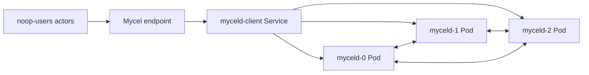

# actor-noop

## Purpose

Validates Mycel Lab scheduling, phase transitions, rate overrides, artifact capture, and k3d environment plumbing without putting correctness pressure on the Mycel daemon. Because the actors are no-ops, failures here usually indicate harness or environment-driver problems rather than graph, raft, or API regressions.

## What this test proves

- The k3d driver can create and tear down a disposable cluster.
- The actor scheduler starts groups, applies phase-level rate overrides, and stops cleanly.
- Run artifacts are emitted even when there is no data-plane workload.

## Topology

## Scenario phases

1. **base-rate**. Duration: `1s`. This phase runs the configured actors at the phase rate and records progress evidence.
2. **slower-rate**. Duration: `1s`. This phase runs the configured actors at the phase rate and records progress evidence.

## Actors

| Actor group | Profile | Count | Rate knobs | Role in this scenario |
|---|---|---:|---|---|
| `noop-users` | `noop` | `3` | `commitsPerSecond` = `9` | exercises scheduler/runtime behavior |

## Tunable parameters

| Parameter | Current value/source | Why tune it |
|---|---|---|
| `seed` | `2468` | Change only when intentionally exploring a different deterministic schedule. |
| `environment.driver` | `k3d` | Selects the infrastructure backend; changing it changes failure semantics. |
| `environment.namespace` | `mycel-lab` | Use a unique namespace/project when running concurrent destructive tests. |
| `clusterRef` | `raft-3-node` | Changes node count, raft placement, image, resources, and storage defaults. |
| `actorGroups[].count` | YAML actor group values | Increase for more concurrency pressure; decrease for faster local debugging. |
| `actorGroups[].rate` | YAML actor group rates | Increase to stress write/read paths; decrease to isolate environment failures. |
| `phases[].duration` | YAML phase durations | Lengthen to catch timing-sensitive bugs; shorten for smoke/debug loops. |

## Evidence and artifacts

- `result.json` is the first stop: it records phase status, duration, and terminal pass/fail state.
- `events.jsonl` shows disruption/backup/snapshot events and their structured payloads.
- `resolved-scenario.json` confirms the exact cluster profile, actor profiles, and overrides used for the run.
- `summary.md` gives a short human-readable run report suitable for PR comments.
- `manifests/myceld.yaml`, `environment/kubernetes-resources.txt`, `environment/pods-describe.txt`, and pod logs explain k3d/Kubernetes failures.
- `oracle/` artifacts, when present, contain final consistency and cluster-health evidence.

## Common failure modes

- Missing k3d/kubectl prerequisites, stale clusters, or namespace cleanup problems prevent environment creation.
- Pod readiness, PVC, or service rendering errors appear in `environment/kubernetes-resources.txt` and `environment/pods-describe.txt`.
- Actor authentication or provisioning failures usually point to bootstrap credentials, principal setup, or endpoint routing.
- Graph correctness failures should be debugged from `actors/`, `events.jsonl`, and `oracle/` before rerunning.
- If a destructive run fails during cleanup, confirm disposable resources were removed before starting another run.

## When to run

Run when changing actor scheduling, phase orchestration, artifact capture, or k3d lifecycle code.

## Related files

- YAML: [`actor-noop.yaml`](./actor-noop.yaml)
- Suites referencing this scenario live under `tests/reliability/suites/`.
