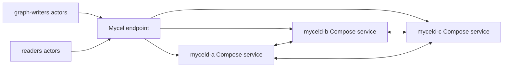

# compose-cluster-soak

## Purpose

Exercises a Docker Compose three-node cluster through repeated graph write/read phases and rolling restarts. It is a medium-duration local soak intended to catch regressions in cluster membership, forwarding, graph replication, and post-restart read convergence without requiring Kubernetes.

## What this test proves

- Graph writers keep committing through Compose service restarts.
- Readers continue to observe committed data after each restart window.
- Compose service discovery and per-node endpoint mapping remain stable over repeated disruption cycles.

## Topology

## Scenario phases

1. **iteration-1**. Duration: `3s`. This phase runs the configured actors at the phase rate and records progress evidence.
2. **restart-1**. Duration: `1s`. Event(s): `rolling-restart`. This phase executes `rolling-restart` while preserving workload/oracle evidence.
3. **iteration-2**. Duration: `3s`. This phase runs the configured actors at the phase rate and records progress evidence.
4. **restart-2**. Duration: `1s`. Event(s): `rolling-restart`. This phase executes `rolling-restart` while preserving workload/oracle evidence.
5. **iteration-3**. Duration: `3s`. This phase runs the configured actors at the phase rate and records progress evidence.

## Actors

| Actor group | Profile | Count | Rate knobs | Role in this scenario |
|---|---|---:|---|---|
| `graph-writers` | `graph-committer` | `3` | `commitsPerSecond` = `9` | writes graph transactions |
| `readers` | `gql-reader` | `3` | `queriesPerSecond` = `6` | reads and validates graph observations |

## Tunable parameters

| Parameter | Current value/source | Why tune it |
|---|---|---|
| `seed` | `22222` | Change only when intentionally exploring a different deterministic schedule. |
| `environment.driver` | `compose` | Selects the infrastructure backend; changing it changes failure semantics. |
| `environment.namespace` | `mycel-lab` | Use a unique namespace/project when running concurrent destructive tests. |
| `clusterRef` | `raft-3-node` | Changes node count, raft placement, image, resources, and storage defaults. |
| `actorGroups[].count` | YAML actor group values | Increase for more concurrency pressure; decrease for faster local debugging. |
| `actorGroups[].rate` | YAML actor group rates | Increase to stress write/read paths; decrease to isolate environment failures. |
| `phases[].duration` | YAML phase durations | Lengthen to catch timing-sensitive bugs; shorten for smoke/debug loops. |
| `phases[].events[].target` | `rolling-restart` targets | Adjust the disrupted node, restart cadence, backup path, snapshot options, or verification timeout. |

## Evidence and artifacts

- `result.json` is the first stop: it records phase status, duration, and terminal pass/fail state.
- `events.jsonl` shows disruption/backup/snapshot events and their structured payloads.
- `resolved-scenario.json` confirms the exact cluster profile, actor profiles, and overrides used for the run.
- `summary.md` gives a short human-readable run report suitable for PR comments.
- `environment/compose-config.yaml`, `environment/compose-ps.txt`, and service logs explain Compose-side failures.
- `oracle/` artifacts, when present, contain final consistency and cluster-health evidence.

## Common failure modes

- Docker Compose unavailable, stale projects, or port collisions prevent environment creation.
- Service logs or `environment/compose-config.yaml` disagree with the expected service/port mapping.
- Actor authentication or provisioning failures usually point to bootstrap credentials, principal setup, or endpoint routing.
- Graph correctness failures should be debugged from `actors/`, `events.jsonl`, and `oracle/` before rerunning.
- If a destructive run fails during cleanup, confirm disposable resources were removed before starting another run.

## When to run

Run before release gates or after changes to Compose fixtures, graph replication, routing, or restart handling.

## Related files

- YAML: [`compose-cluster-soak.yaml`](./compose-cluster-soak.yaml)
- Suites referencing this scenario live under `tests/reliability/suites/`.
