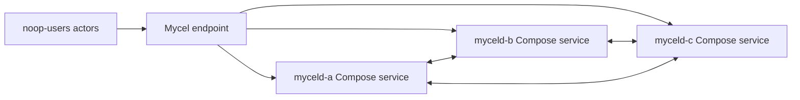

# compose-smoke

## Purpose

Smoke-tests the Compose environment driver and fixture wiring with a deliberately low-risk no-op workload. It verifies local Docker Compose prerequisites, port mapping, optional object-store fixture handling, logs, and cleanup before heavier Compose scenarios are attempted.

## What this test proves

- Compose projects can be rendered, created, inspected, and deleted by Mycel Lab.
- Configured services and host ports are discoverable.
- The object-store fixture path can be planned when requested.

## Topology

## Scenario phases

1. **smoke**. Duration: `1s`. This phase keeps the workload intentionally small while proving the path is functional.

## Actors

| Actor group | Profile | Count | Rate knobs | Role in this scenario |
|---|---|---:|---|---|
| `noop-users` | `noop` | `3` | `commitsPerSecond` = `3` | exercises scheduler/runtime behavior |

## Tunable parameters

| Parameter | Current value/source | Why tune it |
|---|---|---|
| `seed` | `97531` | Change only when intentionally exploring a different deterministic schedule. |
| `environment.driver` | `compose` | Selects the infrastructure backend; changing it changes failure semantics. |
| `environment.namespace` | `mycel-lab` | Use a unique namespace/project when running concurrent destructive tests. |
| `clusterRef` | `raft-3-node` | Changes node count, raft placement, image, resources, and storage defaults. |
| `actorGroups[].count` | YAML actor group values | Increase for more concurrency pressure; decrease for faster local debugging. |
| `actorGroups[].rate` | YAML actor group rates | Increase to stress write/read paths; decrease to isolate environment failures. |
| `phases[].duration` | YAML phase durations | Lengthen to catch timing-sensitive bugs; shorten for smoke/debug loops. |

## Evidence and artifacts

- `result.json` is the first stop: it records phase status, duration, and terminal pass/fail state.
- `events.jsonl` shows disruption/backup/snapshot events and their structured payloads.
- `resolved-scenario.json` confirms the exact cluster profile, actor profiles, and overrides used for the run.
- `summary.md` gives a short human-readable run report suitable for PR comments.
- `environment/compose-config.yaml`, `environment/compose-ps.txt`, and service logs explain Compose-side failures.
- `oracle/` artifacts, when present, contain final consistency and cluster-health evidence.

## Common failure modes

- Docker Compose unavailable, stale projects, or port collisions prevent environment creation.
- Service logs or `environment/compose-config.yaml` disagree with the expected service/port mapping.
- Actor authentication or provisioning failures usually point to bootstrap credentials, principal setup, or endpoint routing.
- Graph correctness failures should be debugged from `actors/`, `events.jsonl`, and `oracle/` before rerunning.
- If a destructive run fails during cleanup, confirm disposable resources were removed before starting another run.

## When to run

Run first when debugging local Compose setup or after changing the Compose driver.

## Related files

- YAML: [`compose-smoke.yaml`](./compose-smoke.yaml)
- Suites referencing this scenario live under `tests/reliability/suites/`.
