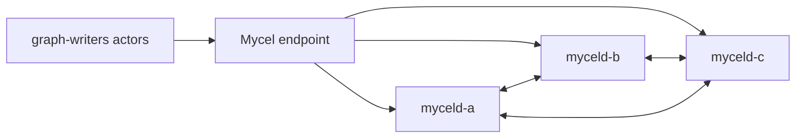

# compose-user-backup-operations

## Purpose

Native Compose user backup export, validate, and import operation smoke.

This document explains the scenario intent, runtime topology, tunable parameters, and evidence to inspect when the test passes or fails.

## Topology

## Scenario phases

1. **write-source-fixture**. Duration: `2s`.
2. **export-validate-import**. Duration: `1s`. Events: user-backup-export, user-backup-validate, user-backup-import.
3. **post-import-stability**. Duration: `1s`.

## Actors

| Actor group | Profile | Count | Rate knobs |
|---|---|---:|---|
| `graph-writers` | `graph-committer` | `1` | commitsPerSecond=4 |

## Tunable parameters

| Parameter | Default/source | Effect |
|---|---|---|
| `seed` | `27272` | Reproducible scheduling and actor randomness. |
| `environment.driver` | `compose` | Selects the environment driver used by the scenario. |
| `environment.namespace` | `mycel-lab` | Kubernetes namespace or logical environment scope. |
| `clusterRef` | `raft-3-node` | Cluster profile used as the base topology. |
| `actorGroups[].count` | YAML actor group values | Number of concurrent actors per group. |
| `actorGroups[].rate` | YAML actor group rates | Workload throughput for commit/query actors. |
| `phases[].duration` | YAML phase durations | How long each workload/disruption phase runs. |
| `phases[].events[].target` | event-specific | Tweaks event behavior for `user-backup-export, user-backup-import, user-backup-validate`. |

## Evidence and artifacts

- `result.json` records phase status and terminal pass/fail state.
- `events.jsonl` records phase events, disruption operations, and correctness failures.
- `summary.md` gives a human-readable run summary.
- `resolved-scenario.json` captures the fully resolved scenario, including profile overrides.
- Environment-specific captures under `environment/` show Kubernetes/Compose state, logs, and endpoints when enabled.

## Common failure modes

- Environment setup failures usually indicate missing local prerequisites or stale Kubernetes/Compose resources.
- Actor failures usually indicate data-plane, authentication, or endpoint-routing issues.
- Final assertion failures should be debugged with `events.jsonl`, `oracle/`, and environment captures before rerunning.
- For destructive scenarios, confirm the namespace/project is disposable before using `--confirm-destructive`.

## Related files

- YAML: [`compose-user-backup-operations.yaml`](./compose-user-backup-operations.yaml)
- Suites referencing this scenario live under `tests/reliability/suites/`.
