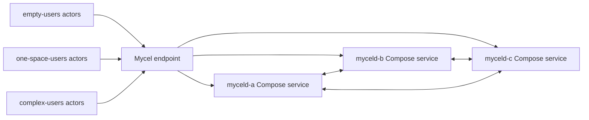

# compose-user-backup-restore

## Purpose

Exercises principal-scoped backup and restore across a fresh Compose cluster. It writes source data, exports and validates backups, destroys/recreates the environment, restores into the fresh cluster, and verifies restored authentication/data access. This is the canonical Compose user-backup restore validation.

## What this test proves

- User backup archives are portable across fresh cluster instances.
- Restored principals can authenticate and query their restored graph state.
- Backup safety checks reject unsafe restore conditions before mutation.

## Topology

## Scenario phases

1. **create-source-fixtures**. Duration: `1s`. Event(s): `user-backup-fixture, user-backup-fixture`. This phase executes `user-backup-fixture, user-backup-fixture` while preserving workload/oracle evidence.
2. **export-validate-and-stage**. Duration: `1s`. Event(s): `user-backup-export, user-backup-export, user-backup-export, user-backup-validate, user-backup-validate, user-backup-validate, user-backup-assert-safety, user-backup-assert-safety, user-backup-assert-safety`. This phase executes `user-backup-export, user-backup-export, user-backup-export, user-backup-validate, user-backup-validate, user-backup-validate, user-backup-assert-safety, user-backup-assert-safety, user-backup-assert-safety` while preserving workload/oracle evidence.
3. **fresh-cluster-reset**. Duration: `1s`. Event(s): `environment-reset`. This phase executes `environment-reset` while preserving workload/oracle evidence.
4. **import-and-verify-restore**. Duration: `1s`. Event(s): `user-backup-import, user-backup-import, user-backup-import, user-backup-verify-restored, user-backup-verify-restored, user-backup-verify-restored, user-backup-assert-safety, user-backup-assert-safety, user-backup-assert-safety`. This phase executes `user-backup-import, user-backup-import, user-backup-import, user-backup-verify-restored, user-backup-verify-restored, user-backup-verify-restored, user-backup-assert-safety, user-backup-assert-safety, user-backup-assert-safety` while preserving workload/oracle evidence.

## Actors

| Actor group | Profile | Count | Rate knobs | Role in this scenario |
|---|---|---:|---|---|
| `empty-users` | `graph-committer` | `1` | `commitsPerSecond` = `0.0001` | writes graph transactions |
| `one-space-users` | `graph-committer` | `1` | `commitsPerSecond` = `0.0001` | writes graph transactions |
| `complex-users` | `graph-committer` | `1` | `commitsPerSecond` = `0.0001` | writes graph transactions |

## Tunable parameters

| Parameter | Current value/source | Why tune it |
|---|---|---|
| `seed` | `28282` | Change only when intentionally exploring a different deterministic schedule. |
| `environment.driver` | `compose` | Selects the infrastructure backend; changing it changes failure semantics. |
| `environment.namespace` | `mycel-lab` | Use a unique namespace/project when running concurrent destructive tests. |
| `clusterRef` | `raft-3-node` | Changes node count, raft placement, image, resources, and storage defaults. |
| `actorGroups[].count` | YAML actor group values | Increase for more concurrency pressure; decrease for faster local debugging. |
| `actorGroups[].rate` | YAML actor group rates | Increase to stress write/read paths; decrease to isolate environment failures. |
| `phases[].duration` | YAML phase durations | Lengthen to catch timing-sensitive bugs; shorten for smoke/debug loops. |
| `phases[].events[].target` | `environment-reset, user-backup-assert-safety, user-backup-export, user-backup-fixture, user-backup-import, user-backup-validate, user-backup-verify-restored` targets | Adjust the disrupted node, restart cadence, backup path, snapshot options, or verification timeout. |

## Evidence and artifacts

- `result.json` is the first stop: it records phase status, duration, and terminal pass/fail state.
- `events.jsonl` shows disruption/backup/snapshot events and their structured payloads.
- `resolved-scenario.json` confirms the exact cluster profile, actor profiles, and overrides used for the run.
- `summary.md` gives a short human-readable run report suitable for PR comments.
- `environment/compose-config.yaml`, `environment/compose-ps.txt`, and service logs explain Compose-side failures.
- `oracle/` artifacts, when present, contain final consistency and cluster-health evidence.

## Common failure modes

- Docker Compose unavailable, stale projects, or port collisions prevent environment creation.
- Service logs or `environment/compose-config.yaml` disagree with the expected service/port mapping.
- Actor authentication or provisioning failures usually point to bootstrap credentials, principal setup, or endpoint routing.
- Graph correctness failures should be debugged from `actors/`, `events.jsonl`, and `oracle/` before rerunning.
- If a destructive run fails during cleanup, confirm disposable resources were removed before starting another run.

## When to run

Run before merging backup/restore changes or release-gate updates that depend on user-level data portability.

## Related files

- YAML: [`compose-user-backup-restore.yaml`](./compose-user-backup-restore.yaml)
- Suites referencing this scenario live under `tests/reliability/suites/`.
