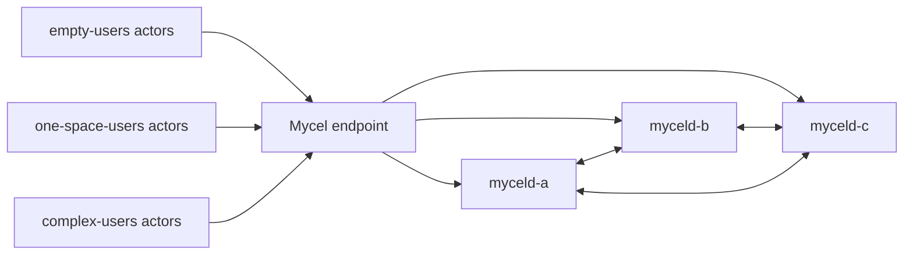

# compose-user-backup-restore

## Purpose

Native Compose principal backup export, validation, fresh-cluster restore, and safety verification.

This document explains the scenario intent, runtime topology, tunable parameters, and evidence to inspect when the test passes or fails.

## Topology

## Scenario phases

1. **create-source-fixtures**. Duration: `1s`. Events: user-backup-fixture, user-backup-fixture.
2. **export-validate-and-stage**. Duration: `1s`. Events: user-backup-export, user-backup-export, user-backup-export, user-backup-validate, user-backup-validate, user-backup-validate, user-backup-assert-safety, user-backup-assert-safety, user-backup-assert-safety.
3. **fresh-cluster-reset**. Duration: `1s`. Events: environment-reset.
4. **import-and-verify-restore**. Duration: `1s`. Events: user-backup-import, user-backup-import, user-backup-import, user-backup-verify-restored, user-backup-verify-restored, user-backup-verify-restored, user-backup-assert-safety, user-backup-assert-safety, user-backup-assert-safety.

## Actors

| Actor group | Profile | Count | Rate knobs |
|---|---|---:|---|
| `empty-users` | `graph-committer` | `1` | commitsPerSecond=0.0001 |
| `one-space-users` | `graph-committer` | `1` | commitsPerSecond=0.0001 |
| `complex-users` | `graph-committer` | `1` | commitsPerSecond=0.0001 |

## Tunable parameters

| Parameter | Default/source | Effect |
|---|---|---|
| `seed` | `28282` | Reproducible scheduling and actor randomness. |
| `environment.driver` | `compose` | Selects the environment driver used by the scenario. |
| `environment.namespace` | `mycel-lab` | Kubernetes namespace or logical environment scope. |
| `clusterRef` | `raft-3-node` | Cluster profile used as the base topology. |
| `actorGroups[].count` | YAML actor group values | Number of concurrent actors per group. |
| `actorGroups[].rate` | YAML actor group rates | Workload throughput for commit/query actors. |
| `phases[].duration` | YAML phase durations | How long each workload/disruption phase runs. |
| `phases[].events[].target` | event-specific | Tweaks event behavior for `environment-reset, user-backup-assert-safety, user-backup-export, user-backup-fixture, user-backup-import, user-backup-validate, user-backup-verify-restored`. |

## Evidence and artifacts

- `result.json` records phase status and terminal pass/fail state.
- `events.jsonl` records phase events, disruption operations, and correctness failures.
- `summary.md` gives a human-readable run summary.
- `resolved-scenario.json` captures the fully resolved scenario, including profile overrides.
- Environment-specific captures under `environment/` show Kubernetes/Compose state, logs, and endpoints when enabled.

## Common failure modes

- Environment setup failures usually indicate missing local prerequisites or stale Kubernetes/Compose resources.
- Actor failures usually indicate data-plane, authentication, or endpoint-routing issues.
- Final assertion failures should be debugged with `events.jsonl`, `oracle/`, and environment captures before rerunning.
- For destructive scenarios, confirm the namespace/project is disposable before using `--confirm-destructive`.

## Related files

- YAML: [`compose-user-backup-restore.yaml`](./compose-user-backup-restore.yaml)
- Suites referencing this scenario live under `tests/reliability/suites/`.
