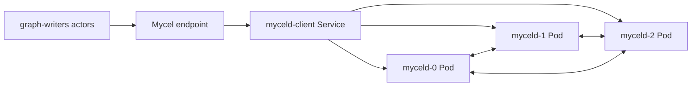

# graph-actor-smoke

## Purpose

Runs a short graph transaction workload against a three-node k3d cluster. It is the basic live graph actor smoke test: enough to prove write plumbing, actor credentials, endpoint routing, and artifact collection without adding disruption.

## What this test proves

- Graph commit actors can create domains/nodes/edges through a live cluster.
- Actor provisioning and daemon authentication work together.
- Final run artifacts include graph actor evidence for debugging.

## Topology

## Scenario phases

1. **graph-smoke**. Duration: `1s`. This phase keeps the workload intentionally small while proving the path is functional.

## Actors

| Actor group | Profile | Count | Rate knobs | Role in this scenario |
|---|---|---:|---|---|
| `graph-writers` | `graph-committer` | `2` | `commitsPerSecond` = `20` | writes graph transactions |

## Tunable parameters

| Parameter | Current value/source | Why tune it |
|---|---|---|
| `seed` | `4242` | Change only when intentionally exploring a different deterministic schedule. |
| `environment.driver` | `k3d` | Selects the infrastructure backend; changing it changes failure semantics. |
| `environment.namespace` | `mycel-lab` | Use a unique namespace/project when running concurrent destructive tests. |
| `clusterRef` | `raft-3-node` | Changes node count, raft placement, image, resources, and storage defaults. |
| `actorGroups[].count` | YAML actor group values | Increase for more concurrency pressure; decrease for faster local debugging. |
| `actorGroups[].rate` | YAML actor group rates | Increase to stress write/read paths; decrease to isolate environment failures. |
| `phases[].duration` | YAML phase durations | Lengthen to catch timing-sensitive bugs; shorten for smoke/debug loops. |
| `clusterOverrides` | YAML overrides | Scenario-specific cluster settings layered on the referenced profile. |

## Evidence and artifacts

- `result.json` is the first stop: it records phase status, duration, and terminal pass/fail state.
- `events.jsonl` shows disruption/backup/snapshot events and their structured payloads.
- `resolved-scenario.json` confirms the exact cluster profile, actor profiles, and overrides used for the run.
- `summary.md` gives a short human-readable run report suitable for PR comments.
- `manifests/myceld.yaml`, `environment/kubernetes-resources.txt`, `environment/pods-describe.txt`, and pod logs explain k3d/Kubernetes failures.
- `oracle/` artifacts, when present, contain final consistency and cluster-health evidence.

## Common failure modes

- Missing k3d/kubectl prerequisites, stale clusters, or namespace cleanup problems prevent environment creation.
- Pod readiness, PVC, or service rendering errors appear in `environment/kubernetes-resources.txt` and `environment/pods-describe.txt`.
- Actor authentication or provisioning failures usually point to bootstrap credentials, principal setup, or endpoint routing.
- Graph correctness failures should be debugged from `actors/`, `events.jsonl`, and `oracle/` before rerunning.
- If a destructive run fails during cleanup, confirm disposable resources were removed before starting another run.

## When to run

Run after graph actor, provisioning, auth, endpoint, or basic k3d driver changes.

## Related files

- YAML: [`graph-actor-smoke.yaml`](./graph-actor-smoke.yaml)
- Suites referencing this scenario live under `tests/reliability/suites/`.
