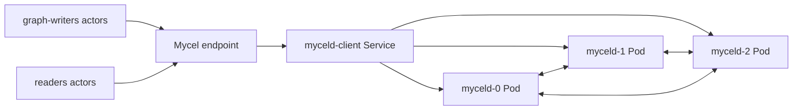

# k3d-raft-disruption-edges

## Purpose

Combines an edge-heavy graph workload with rolling raft-node restarts in k3d. It targets graph adjacency/index consistency under raft disruption, where edge writes are more likely to expose ordering, deduplication, or recovery bugs than simple node-only writes.

## What this test proves

- Edge-heavy graph transactions remain durable across node restarts.
- Readers and final oracles can observe a consistent post-disruption graph.
- Raft disruption does not corrupt graph adjacency/index state.

## Topology

## Scenario phases

1. **warmup**. Duration: `2s`. This phase runs the configured actors at the phase rate and records progress evidence.
2. **rolling-restart**. Duration: `2s`. Event(s): `rolling-restart`. This phase executes `rolling-restart` while preserving workload/oracle evidence.
3. **recovery**. Duration: `2s`. This phase runs the configured actors at the phase rate and records progress evidence.

## Actors

| Actor group | Profile | Count | Rate knobs | Role in this scenario |
|---|---|---:|---|---|
| `graph-writers` | `graph-committer` | `2` | `commitsPerSecond` = `20` | writes graph transactions |
| `readers` | `gql-reader` | `2` | `queriesPerSecond` = `4` | reads and validates graph observations |

## Tunable parameters

| Parameter | Current value/source | Why tune it |
|---|---|---|
| `seed` | `21212` | Change only when intentionally exploring a different deterministic schedule. |
| `environment.driver` | `k3d` | Selects the infrastructure backend; changing it changes failure semantics. |
| `environment.namespace` | `mycel-lab` | Use a unique namespace/project when running concurrent destructive tests. |
| `clusterRef` | `raft-3-node` | Changes node count, raft placement, image, resources, and storage defaults. |
| `actorGroups[].count` | YAML actor group values | Increase for more concurrency pressure; decrease for faster local debugging. |
| `actorGroups[].rate` | YAML actor group rates | Increase to stress write/read paths; decrease to isolate environment failures. |
| `phases[].duration` | YAML phase durations | Lengthen to catch timing-sensitive bugs; shorten for smoke/debug loops. |
| `phases[].events[].target` | `rolling-restart` targets | Adjust the disrupted node, restart cadence, backup path, snapshot options, or verification timeout. |

## Evidence and artifacts

- `result.json` is the first stop: it records phase status, duration, and terminal pass/fail state.
- `events.jsonl` shows disruption/backup/snapshot events and their structured payloads.
- `resolved-scenario.json` confirms the exact cluster profile, actor profiles, and overrides used for the run.
- `summary.md` gives a short human-readable run report suitable for PR comments.
- `manifests/myceld.yaml`, `environment/kubernetes-resources.txt`, `environment/pods-describe.txt`, and pod logs explain k3d/Kubernetes failures.
- `oracle/` artifacts, when present, contain final consistency and cluster-health evidence.

## Common failure modes

- Missing k3d/kubectl prerequisites, stale clusters, or namespace cleanup problems prevent environment creation.
- Pod readiness, PVC, or service rendering errors appear in `environment/kubernetes-resources.txt` and `environment/pods-describe.txt`.
- Actor authentication or provisioning failures usually point to bootstrap credentials, principal setup, or endpoint routing.
- Graph correctness failures should be debugged from `actors/`, `events.jsonl`, and `oracle/` before rerunning.
- If a destructive run fails during cleanup, confirm disposable resources were removed before starting another run.

## When to run

Run after changes to graph edge storage, indexes, raft replication, restart recovery, or disruption-event code.

## Related files

- YAML: [`k3d-raft-disruption-edges.yaml`](./k3d-raft-disruption-edges.yaml)
- Suites referencing this scenario live under `tests/reliability/suites/`.
