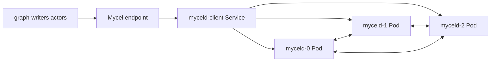

# k3d-raft-disruption-smoke

## Purpose

Provides a short k3d raft disruption smoke test with one logical node restart. It is the fastest way to verify the disruption event pipeline, pod restart handling, and basic raft recovery before running heavier all-node or edge workloads.

## What this test proves

- Mycel Lab can target and restart a k3d daemon pod during a workload.
- A three-node raft cluster remains usable after a single member restart.
- Graph actor evidence and final cluster health are captured after disruption.

## Topology

## Scenario phases

1. **warmup**. Duration: `2s`. This phase runs the configured actors at the phase rate and records progress evidence.
2. **restart-node-0**. Duration: `2s`. Event(s): `node-restart`. This phase executes `node-restart` while preserving workload/oracle evidence.
3. **recovery**. Duration: `2s`. This phase runs the configured actors at the phase rate and records progress evidence.

## Actors

| Actor group | Profile | Count | Rate knobs | Role in this scenario |
|---|---|---:|---|---|
| `graph-writers` | `graph-committer` | `1` | `commitsPerSecond` = `5` | writes graph transactions |

## Tunable parameters

| Parameter | Current value/source | Why tune it |
|---|---|---|
| `seed` | `19191` | Change only when intentionally exploring a different deterministic schedule. |
| `environment.driver` | `k3d` | Selects the infrastructure backend; changing it changes failure semantics. |
| `environment.namespace` | `mycel-lab` | Use a unique namespace/project when running concurrent destructive tests. |
| `clusterRef` | `raft-3-node` | Changes node count, raft placement, image, resources, and storage defaults. |
| `actorGroups[].count` | YAML actor group values | Increase for more concurrency pressure; decrease for faster local debugging. |
| `actorGroups[].rate` | YAML actor group rates | Increase to stress write/read paths; decrease to isolate environment failures. |
| `phases[].duration` | YAML phase durations | Lengthen to catch timing-sensitive bugs; shorten for smoke/debug loops. |
| `phases[].events[].target` | `node-restart` targets | Adjust the disrupted node, restart cadence, backup path, snapshot options, or verification timeout. |

## Evidence and artifacts

- `result.json` is the first stop: it records phase status, duration, and terminal pass/fail state.
- `events.jsonl` shows disruption/backup/snapshot events and their structured payloads.
- `resolved-scenario.json` confirms the exact cluster profile, actor profiles, and overrides used for the run.
- `summary.md` gives a short human-readable run report suitable for PR comments.
- `manifests/myceld.yaml`, `environment/kubernetes-resources.txt`, `environment/pods-describe.txt`, and pod logs explain k3d/Kubernetes failures.
- `oracle/` artifacts, when present, contain final consistency and cluster-health evidence.

## Common failure modes

- Missing k3d/kubectl prerequisites, stale clusters, or namespace cleanup problems prevent environment creation.
- Pod readiness, PVC, or service rendering errors appear in `environment/kubernetes-resources.txt` and `environment/pods-describe.txt`.
- Actor authentication or provisioning failures usually point to bootstrap credentials, principal setup, or endpoint routing.
- Graph correctness failures should be debugged from `actors/`, `events.jsonl`, and `oracle/` before rerunning.
- If a destructive run fails during cleanup, confirm disposable resources were removed before starting another run.

## When to run

Run first when changing k3d disruption events, pod selection, restart waits, or basic raft recovery behavior.

## Related files

- YAML: [`k3d-raft-disruption-smoke.yaml`](./k3d-raft-disruption-smoke.yaml)
- Suites referencing this scenario live under `tests/reliability/suites/`.
