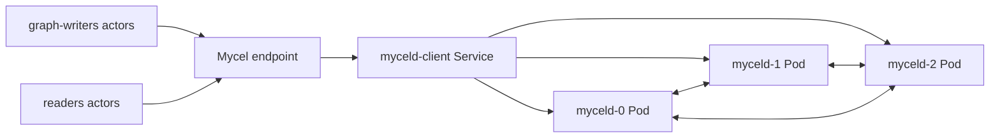

# k3d-raft-snapshot-pvc-rejoin

## Purpose

Validates the same-raft-ID PVC replacement recovery path. The scenario wipes the last StatefulSet member's PVC while it is offline, forces compacted snapshots on the active quorum, rejoins the wiped ordinal with the same raft ID, and requires every configured raft group on that node to report nonzero snapshot progress. It exists to prevent regressions of mycel#148.

## What this test proves

- A wiped same-ID raft member can rejoin after active-quorum snapshots.
- System and partition raft groups are all present on the rejoined node.
- Every expected group reports a nonzero `snapshot_index`, so idle partition groups cannot silently skip snapshot recovery.

## Topology

## Scenario phases

1. **bootstrap-and-write**. Duration: `5s`. This phase establishes baseline actor data before disruption or verification.
2. **replace-last-pvc**. Duration: `1s`. Event(s): `raft-pvc-replace-node`. This phase executes `raft-pvc-replace-node` while preserving workload/oracle evidence.
3. **post-rejoin-validation**. Duration: `5s`. This phase lets readers/oracles verify that committed data and cluster state converged.
4. **verify-rejoined-snapshot-indexes**. Duration: `1s`. Event(s): `raft-snapshot-verify-rejoined`. This phase executes `raft-snapshot-verify-rejoined` while preserving workload/oracle evidence.

## Actors

| Actor group | Profile | Count | Rate knobs | Role in this scenario |
|---|---|---:|---|---|
| `graph-writers` | `graph-committer` | `1` | `commitsPerSecond` = `8` | writes graph transactions |
| `readers` | `gql-reader` | `1` | `queriesPerSecond` = `4` | reads and validates graph observations |

## Tunable parameters

| Parameter | Current value/source | Why tune it |
|---|---|---|
| `seed` | `30303` | Change only when intentionally exploring a different deterministic schedule. |
| `environment.driver` | `k3d` | Selects the infrastructure backend; changing it changes failure semantics. |
| `environment.namespace` | `mycel-raft-snapshot-pvc-rejoin` | Use a unique namespace/project when running concurrent destructive tests. |
| `clusterRef` | `raft-3-node` | Changes node count, raft placement, image, resources, and storage defaults. |
| `actorGroups[].count` | YAML actor group values | Increase for more concurrency pressure; decrease for faster local debugging. |
| `actorGroups[].rate` | YAML actor group rates | Increase to stress write/read paths; decrease to isolate environment failures. |
| `phases[].duration` | YAML phase durations | Lengthen to catch timing-sensitive bugs; shorten for smoke/debug loops. |
| `phases[].events[].target` | `raft-pvc-replace-node, raft-snapshot-verify-rejoined` targets | Adjust the disrupted node, restart cadence, backup path, snapshot options, or verification timeout. |
| `clusterOverrides` | YAML overrides | Scenario-specific cluster settings layered on the referenced profile. |

## Evidence and artifacts

- `result.json` is the first stop: it records phase status, duration, and terminal pass/fail state.
- `events.jsonl` shows disruption/backup/snapshot events and their structured payloads.
- `resolved-scenario.json` confirms the exact cluster profile, actor profiles, and overrides used for the run.
- `summary.md` gives a short human-readable run report suitable for PR comments.
- `manifests/myceld.yaml`, `environment/kubernetes-resources.txt`, `environment/pods-describe.txt`, and pod logs explain k3d/Kubernetes failures.
- `oracle/` artifacts, when present, contain final consistency and cluster-health evidence.

## Common failure modes

- Missing k3d/kubectl prerequisites, stale clusters, or namespace cleanup problems prevent environment creation.
- Pod readiness, PVC, or service rendering errors appear in `environment/kubernetes-resources.txt` and `environment/pods-describe.txt`.
- Actor authentication or provisioning failures usually point to bootstrap credentials, principal setup, or endpoint routing.
- Graph correctness failures should be debugged from `actors/`, `events.jsonl`, and `oracle/` before rerunning.
- If a destructive run fails during cleanup, confirm disposable resources were removed before starting another run.

## When to run

Run after raft snapshot, compaction, persistent storage, StatefulSet PVC, or empty-storage rejoin changes.

## Related files

- YAML: [`k3d-raft-snapshot-pvc-rejoin.yaml`](./k3d-raft-snapshot-pvc-rejoin.yaml)
- Suites referencing this scenario live under `tests/reliability/suites/`.
