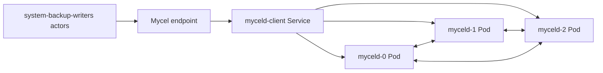

# k3d-system-backup-restore

## Purpose

Validates full-system backup and restore in Kubernetes. It creates live graph data, requests a daemon-owned cluster backup, replaces/restores PVCs for StatefulSet ordinals, and verifies restored authentication and data access. This scenario guards the disaster-recovery contract for k3d deployments.

## What this test proves

- Cluster backup operations reach a completed daemon state before restore begins.
- PVC restore mounts data at the daemon's expected path and restarts cleanly.
- Restored users can authenticate and query data written before the backup.

## Topology

## Scenario phases

1. **create-workload-fixture**. Duration: `1s`. Event(s): `system-backup-fixture`. This phase executes `system-backup-fixture` while preserving workload/oracle evidence.
2. **capture-and-validate-backup**. Duration: `1s`. Event(s): `cluster-backup-create, cluster-backup-validate`. This phase executes `cluster-backup-create, cluster-backup-validate` while preserving workload/oracle evidence.
3. **restore-into-fresh-pvcs**. Duration: `1s`. Event(s): `cluster-restore-apply`. This phase executes `cluster-restore-apply` while preserving workload/oracle evidence.
4. **verify-restored-cluster**. Duration: `1s`. Event(s): `cluster-restore-verify`. This phase executes `cluster-restore-verify` while preserving workload/oracle evidence.

## Actors

| Actor group | Profile | Count | Rate knobs | Role in this scenario |
|---|---|---:|---|---|
| `system-backup-writers` | `graph-committer` | `1` | `commitsPerSecond` = `0.0001` | writes graph transactions |

## Tunable parameters

| Parameter | Current value/source | Why tune it |
|---|---|---|
| `seed` | `29292` | Change only when intentionally exploring a different deterministic schedule. |
| `environment.driver` | `k3d` | Selects the infrastructure backend; changing it changes failure semantics. |
| `environment.namespace` | `mycel-system-backup-restore` | Use a unique namespace/project when running concurrent destructive tests. |
| `clusterRef` | `raft-3-node` | Changes node count, raft placement, image, resources, and storage defaults. |
| `actorGroups[].count` | YAML actor group values | Increase for more concurrency pressure; decrease for faster local debugging. |
| `actorGroups[].rate` | YAML actor group rates | Increase to stress write/read paths; decrease to isolate environment failures. |
| `phases[].duration` | YAML phase durations | Lengthen to catch timing-sensitive bugs; shorten for smoke/debug loops. |
| `phases[].events[].target` | `cluster-backup-create, cluster-backup-validate, cluster-restore-apply, cluster-restore-verify, system-backup-fixture` targets | Adjust the disrupted node, restart cadence, backup path, snapshot options, or verification timeout. |

## Evidence and artifacts

- `result.json` is the first stop: it records phase status, duration, and terminal pass/fail state.
- `events.jsonl` shows disruption/backup/snapshot events and their structured payloads.
- `resolved-scenario.json` confirms the exact cluster profile, actor profiles, and overrides used for the run.
- `summary.md` gives a short human-readable run report suitable for PR comments.
- `manifests/myceld.yaml`, `environment/kubernetes-resources.txt`, `environment/pods-describe.txt`, and pod logs explain k3d/Kubernetes failures.
- `oracle/` artifacts, when present, contain final consistency and cluster-health evidence.

## Common failure modes

- Missing k3d/kubectl prerequisites, stale clusters, or namespace cleanup problems prevent environment creation.
- Pod readiness, PVC, or service rendering errors appear in `environment/kubernetes-resources.txt` and `environment/pods-describe.txt`.
- Actor authentication or provisioning failures usually point to bootstrap credentials, principal setup, or endpoint routing.
- Graph correctness failures should be debugged from `actors/`, `events.jsonl`, and `oracle/` before rerunning.
- If a destructive run fails during cleanup, confirm disposable resources were removed before starting another run.

## When to run

Run before backup/restore releases and after changes to backup orchestration, PVC rendering, restore verification, auth, or graph durability.

## Related files

- YAML: [`k3d-system-backup-restore.yaml`](./k3d-system-backup-restore.yaml)
- Suites referencing this scenario live under `tests/reliability/suites/`.
